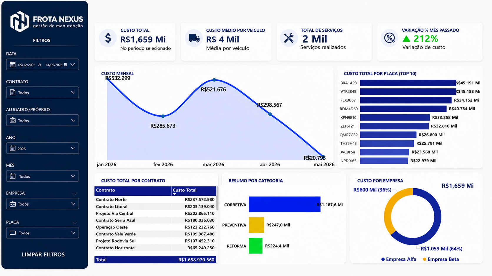
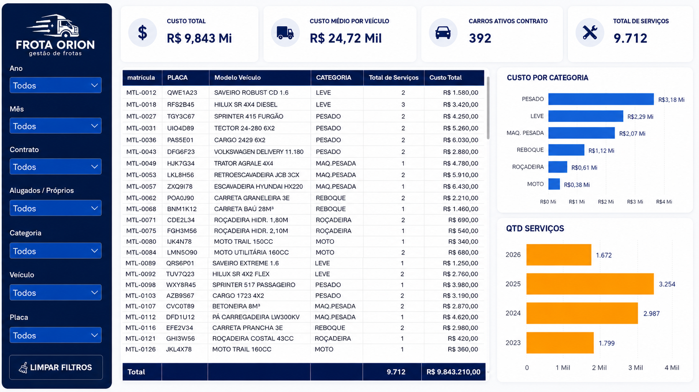
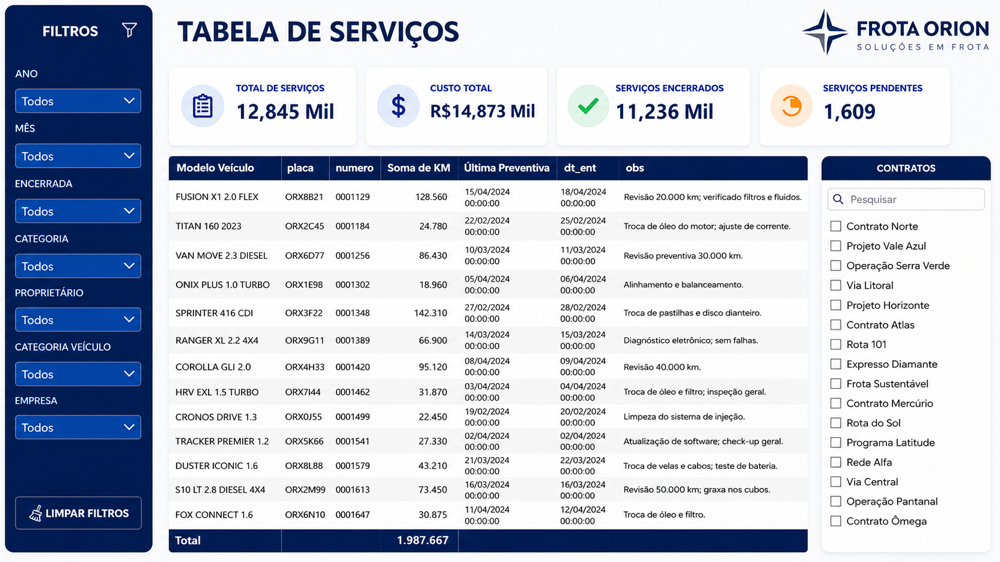

# 🚛 Fleet Maintenance Dashboard | Dashboard de Manutenção de Frota

## 🇺🇸 English

This project presents a fleet maintenance dashboard developed with **SQL + Power BI**, focused on analyzing costs, completed services, active vehicles, and operational indicators.

The goal of the dashboard is to transform maintenance data into visual insights, making fleet monitoring easier and supporting decision-making.

---

## 📊 Project Overview

The dashboard allows users to monitor key operational indicators, such as:

- Total maintenance cost
- Average cost per vehicle
- Total services performed
- Completed and pending services
- Active vehicles by contract
- Costs by category
- Number of services by year
- Detailed service table
- Filters by year, month, contract, category, vehicle, company, and license plate

---

## 🖼️ Dashboard Images

### Overview



### Vehicle and Category Analysis



### Services Table



---

## 🛠️ Technologies Used

- SQL
- Power BI
- DAX
- Data Modeling
- Data Visualization
- Business Intelligence

---

## 🧮 DAX Measures

The main DAX measures used in this project are available in:

//------------------PT-BR-----------------//

# 🚛 Fleet Maintenance Dashboard | Dashboard de Manutenção de Frota

## 🇧🇷 Português

Este projeto apresenta um dashboard de manutenção de frota desenvolvido com **SQL + Power BI**, com foco na análise de custos, serviços realizados, veículos ativos e indicadores operacionais.

O objetivo do dashboard é transformar dados de manutenção em informações visuais, facilitando o acompanhamento da frota e apoiando a tomada de decisão.

---

## 📊 Visão Geral do Projeto

O dashboard permite acompanhar indicadores operacionais importantes, como:

- Custo total de manutenção
- Custo médio por veículo
- Total de serviços realizados
- Serviços concluídos e pendentes
- Veículos ativos por contrato
- Custos por categoria
- Quantidade de serviços por ano
- Tabela detalhada de serviços
- Filtros por ano, mês, contrato, categoria, veículo, empresa e placa

---

## 🛠️ Tecnologias Utilizadas

- SQL
- Power BI
- DAX
- Modelagem de Dados
- Visualização de Dados
- Business Intelligence

---

## 🧮 Medidas DAX

As principais medidas DAX utilizadas neste projeto estão disponíveis em:

```text
MEDIDAS.md


```text
MEDIDAS.md
